# Analysis of fitness dynamics

This analysis reconstructs variant fitness across overlapping seasonal MLR fits,
stitches it onto a common "scaffolded" scale, and characterizes the traveling
wave of fitness ("flux") through time, for three datasets: `sarscov2_clades`,
`sarscov2_lineages` and `h3n2_clades`.

The calculations were originally done in the Mathematica notebook
`fitness-flux.nb` (retained for reference). They are now reimplemented as Python
scripts in `scripts/`, wired into Snakemake via `rules/fitness_flux_analysis.smk`,
writing TSV/JSON to `results/`. The narrative is presented interactively by
`viz/fitness-flux.html`.

## Inputs

Each analysis dataset aggregates the per-season MLR runs produced by the main
pipeline, e.g.:
```
mlr-estimates/sarscov2_clades_2020/mlr_results.json
mlr-estimates/sarscov2_clades_2020-21/mlr_results.json
...
```
The seasons belonging to a dataset are the prefix-matching entries of
`datasets:` in `defaults/config.yaml`. Mutation counts per clade are versioned in
`source-data/{dataset}_mut_counts.tsv`.

## Pipeline

From the repository root:
```
pip install -r requirements.txt
snakemake all_fitness_flux
```

The rule chain (one set per dataset) runs these scripts:

| Script | Output(s) in `results/` | Purpose |
| --- | --- | --- |
| `gather_fitness.py` | `{dataset}_direct_fitness.tsv` | per-season `log(growth advantage)` per variant |
| `scaffold_fitness.py` | `{dataset}_scaffolded_fitness.tsv` | stitch seasons onto a common scale via shared-variant ratios |
| `gather_frequencies.py` | `{dataset}_frequencies.tsv`, `{dataset}_mean_date.tsv` | renormalized weekly frequencies and frequency-weighted mean dates |
| `fitness_wave.py` | `{dataset}_flux_timeseries.tsv`, `{dataset}_flux_summary.json` | mean fitness (wave centre), variance, and per-generation velocity; the variance-vs-velocity slope |
| `mutation_fitness.py` | `{dataset}_mutation_fitness.tsv` | join mutation counts to scaffolded fitness and mean date |

`scaffold_fitness.py` accepts `--validate <reference.tsv>` to compare against a
known-good output; the H3N2 and SARS-CoV-2 clade outputs reproduce the previously
committed tables exactly.

## Visualization

`viz/fitness-flux.html` (a self-contained Observable Plot / d3 page served as part
of the static GitHub Pages site) fetches these `results/` tables at runtime and
renders scaffolded fitness through time, frequencies, mutation–fitness relations,
and the fitness wave. Figure renders are no longer exported from Python; the PNGs
under `figures/` remain from the original notebook.

## SARS-CoV-2 clades

### Empirical frequencies vs MLR modeled frequencies

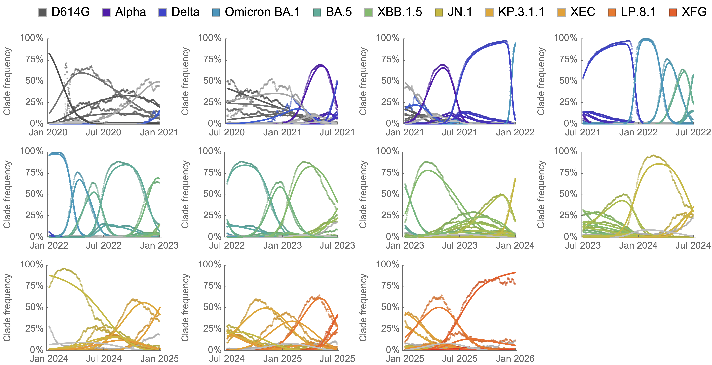

### Time vs MLR fitness

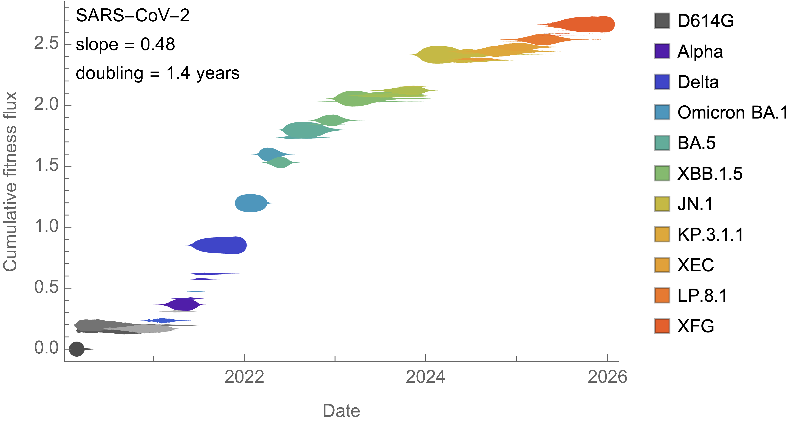

### Time vs S1 mutation count

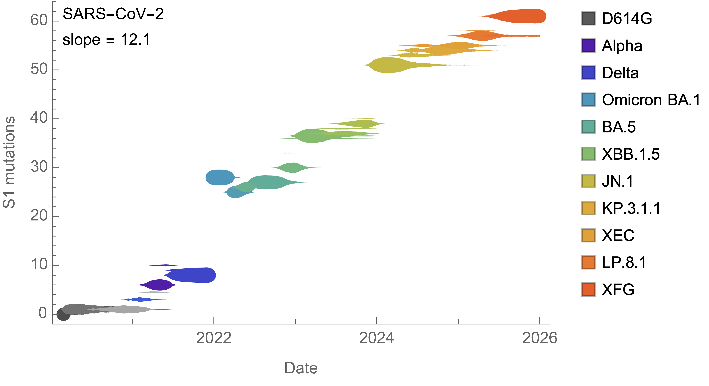

### S1 mutation count vs MLR fitness

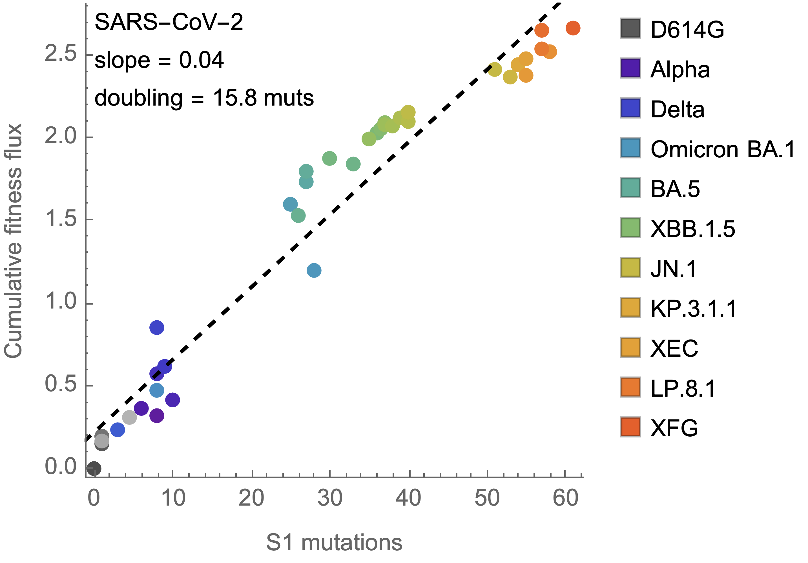

### Population average cumulative fitness flux

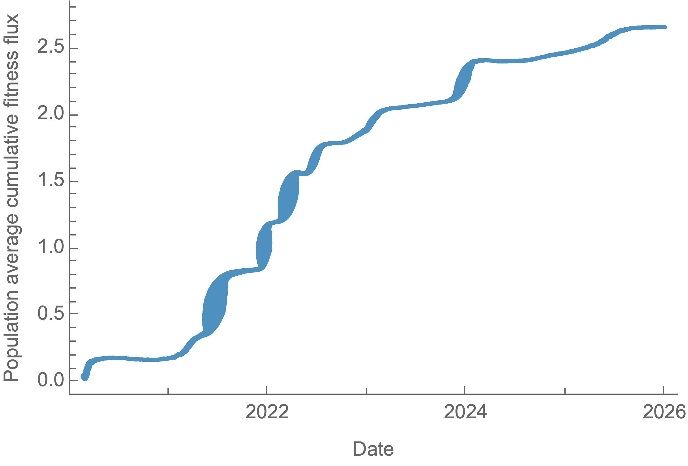

### Fitness Variance vs fitness velocity

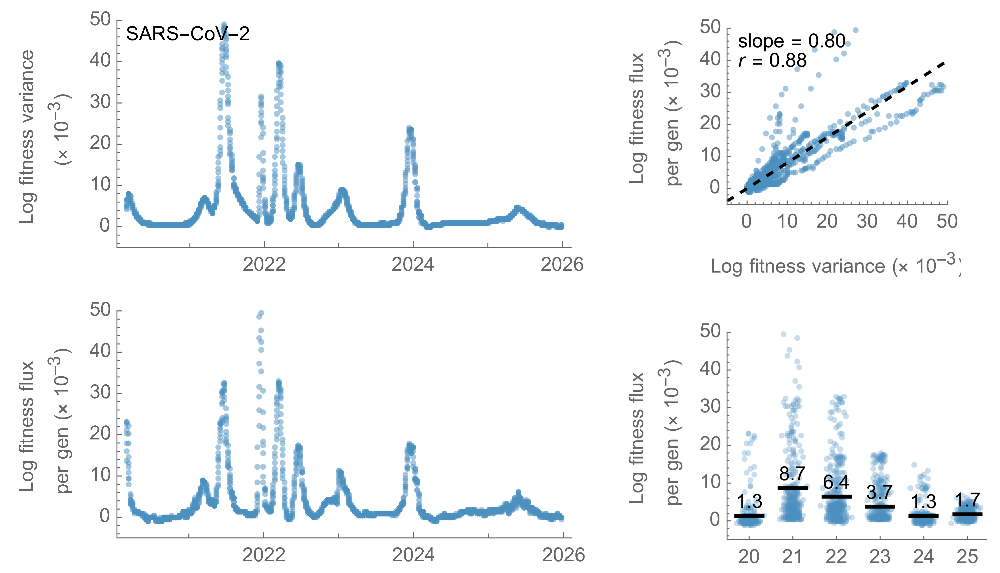

## SARS-CoV-2 lineages

### Empirical frequencies vs MLR modeled frequencies


### Time vs MLR fitness


### Time vs S1 mutation count


### S1 mutation count vs MLR fitness


## H3N2 clades

### Empirical frequencies vs MLR modeled frequencies

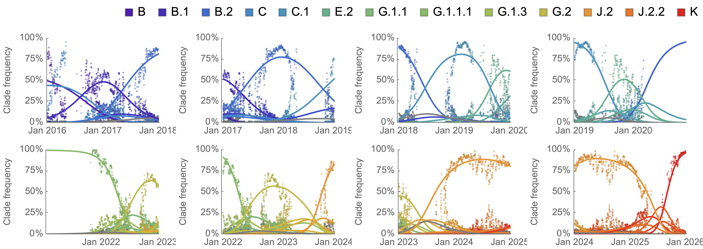

### Time vs MLR fitness

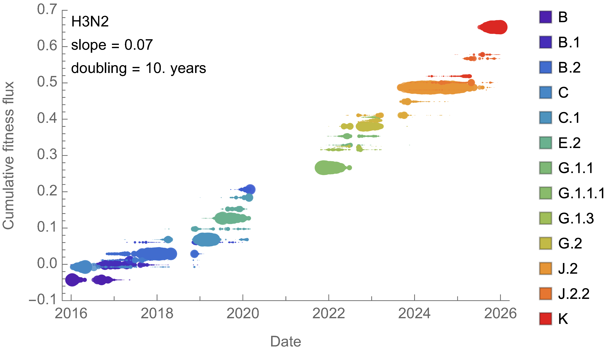

### Time vs S1 mutation count

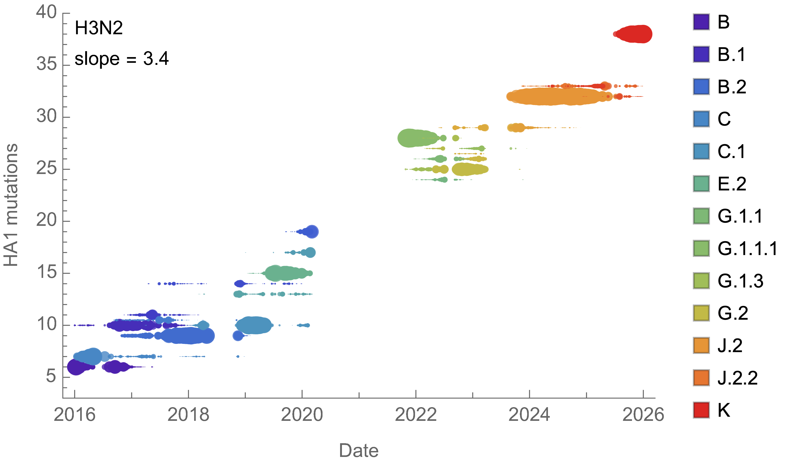

### S1 mutation count vs MLR fitness

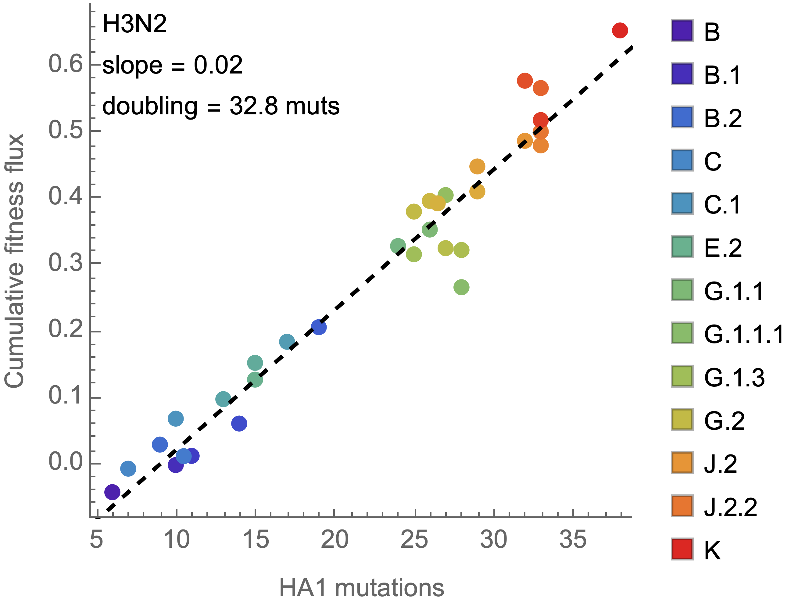

### Population average cumulative fitness flux

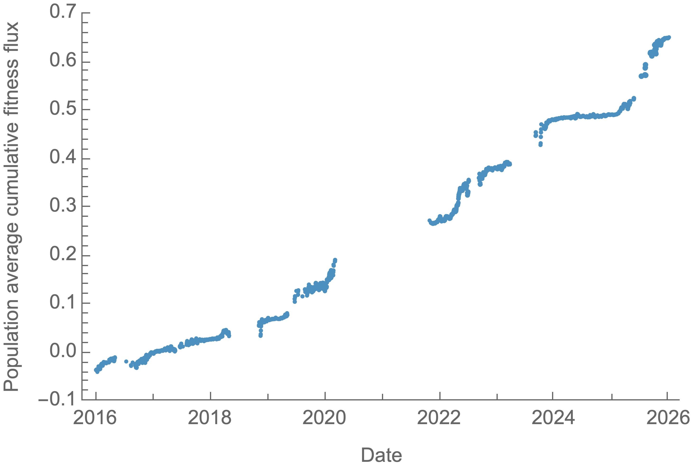

### Fitness Variance vs fitness velocity

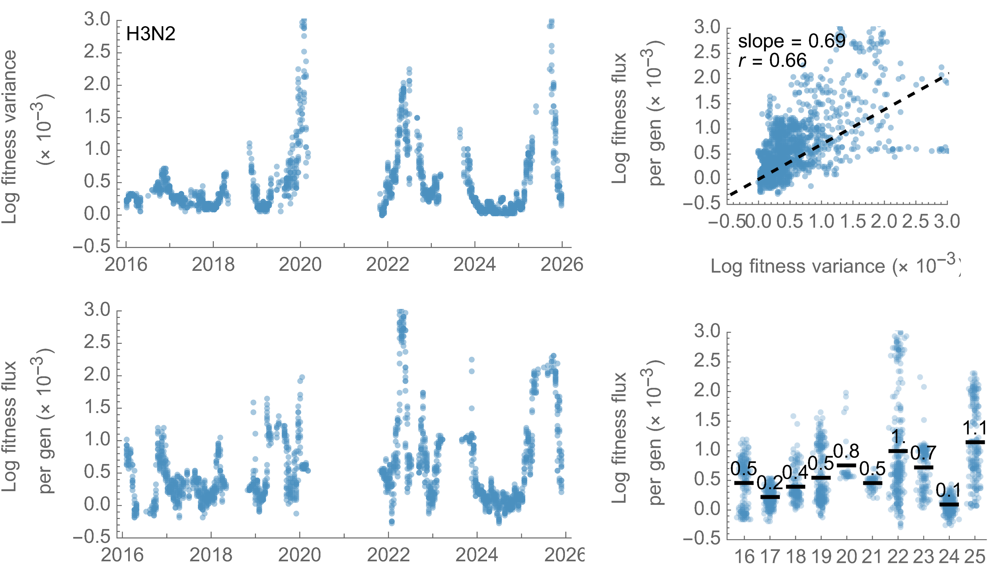
