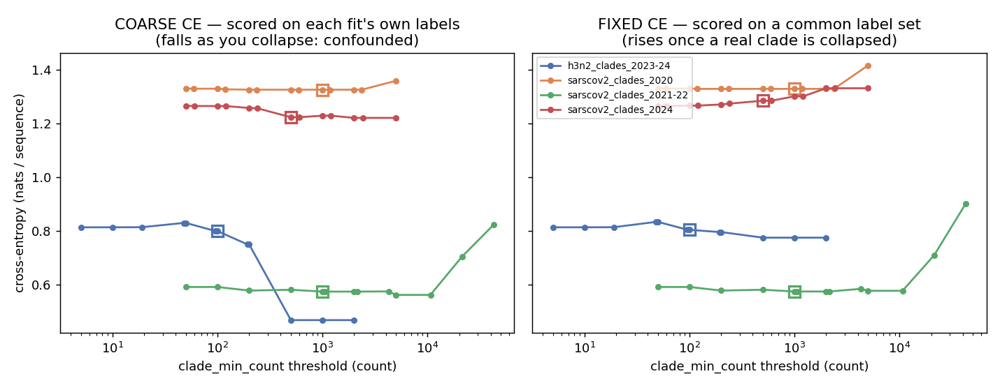
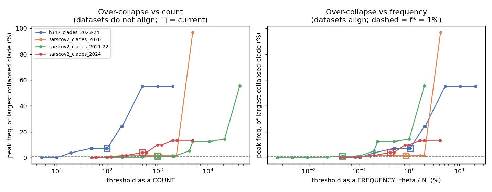
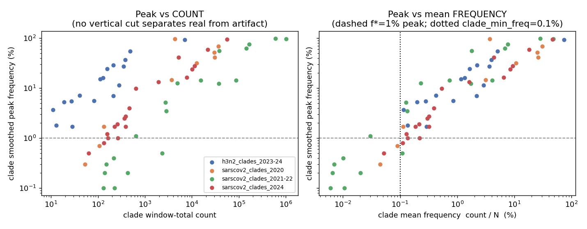

# Choosing the rare-clade collapsing threshold (`clade_min_count` / `clade_min_freq`)

## Summary

Before MLR fitting, a clade with too few sequences is collapsed into a catch-all
`other` category. The lever was a per-window count threshold, `clade_min_seq`
(here renamed `clade_min_count`), set by hand and varying across datasets
(SARS-CoV-2 clades 150–1000, H3N2 clades 50–100). This analysis asks whether
there is a principled way to set it, and whether a single value (e.g. 100) would
work everywhere.

**Findings.**

1. The natural metric — cross-entropy between modeled frequencies and observed
   clade labels — **does not work as proposed**, and neither would MSE/MAE.
   Scored on each fit's own label set it is confounded by partition coarseness:
   collapsing rare clades into a high-frequency `other` bucket mechanically
   lowers the loss, so the metric *rewards* collapsing. For H3N2 it is minimised
   by collapsing everything down to two categories.
2. Scoring on a **common (fixed) label set** removes the confound and yields
   sensible interior optima for SARS-CoV-2 (≈0.04–0.10 % of window size), but
   stays unreliable for fast-moving H3N2 because it inherits the MLR's temporal
   smoothing error.
3. The robust, model-free criterion is the **peak smoothed frequency of the
   largest clade folded into `other`**. A clade reaching ≳1 % is a real,
   trackable fitness entity; one that never clears a few tenths of a percent is
   noise or an assembly-error miscall. This directly operationalises the
   intuition that *artifacts manifest as a frequency, not a count*.

**Verdict on "100 for everything".** No. A fixed count is the wrong instrument
because the same count is a different frequency in every window: 100 sequences
is 0.005 % of the 2.1 M-sequence 2021-22 window (keeps everything real, excludes
only true artifacts) but ~1 % of the ~9.6 k-sequence H3N2 window, where it
collapses clades that peak at 5–7 %.

**Recommendation.** Replace the fixed count with a **mean-frequency threshold**,
`clade_min_freq = 0.1 %` (collapse a clade iff its window-total count is below
0.1 % of the window total), backed by a **count floor `clade_min_count = 50`**
(the renamed former `clade_min_seq`) as a minimum-data guard. Mean frequency is a
clade's count divided by the window total, so it needs no empirical-frequency
analysis, auto-scales with window size, and — because a clade's smoothed *peak*
tracks its *mean* tightly (r = 0.94 in log–log) — it reproduces the peak ≥ 1 %
keep/drop rule with the fewest misclassifications at exactly 0.1 %. The two
thresholds bind at opposite ends (frequency for high-volume windows, the count
floor for low-volume H3N2). Both are implemented in `prepare-data.py`
(`--clade-min-freq`, `--clade-min-count`) and set in `defaults/config.yaml` for
all clade datasets. The one case neither catches is the within-window inversion
(a transient real clade with a low mean); only a peak-frequency lever would, at
the cost of an empirical-frequency calculation.

## Background: the lever

The pipeline is `seq_counts.tsv` (raw daily counts, cached and
threshold-independent) → `prepare-data.py` (a clade whose total count over the
window is `< clade_min_count`, or below `clade_min_freq` as a fraction of the
window total, is relabeled `other`) → `run-mlr-model.py` →
`mlr_results.json` (modeled frequency per surviving variant plus `other`).
Because the raw counts are cached, a threshold sweep only re-runs `prepare-data`
+ MLR, and the MLR can use a fast MAP fit. The two-sided worry:

- **Too high** → real clades are folded into `other`, which the MLR then models
  with a single fitness even though it is a mixture of clades growing at
  different rates (a misspecification).
- **Too low** → small clades give noisy estimates, and at high sequence volume a
  count threshold also admits assembly-error miscalls, which sit at a roughly
  constant low *frequency*.

## Why cross-entropy (as proposed) fails — and MSE/MAE too

For a fit at threshold θ with observed daily counts n\_{v,d} and modeled
frequencies f\_{v,d}, the proposed metric is the multinomial cross-entropy
CE(θ) = −(1/N) Σ n\_{v,d} log f\_{v,d}, including `other`. The problem is that
**the outcome space changes with θ**. Raising θ relabels rare clades as `other`,
a single high-frequency category that is trivially predictable, so a coarser
partition has lower entropy. CE therefore falls as you collapse — it has no
honest interior optimum.

This is not specific to cross-entropy. MSE or MAE on the predicted frequencies
has the identical pathology: collapse everything into `other` and the model
predicts `other ≈ 1` against an observed `≈ 1`, giving near-zero error.
Dropping `other` from the metric does not help either — it merely removes the
small, hard-to-fit clades from the gradebook, so the average error still falls
as θ rises. The confound is in the *label set*, not the loss function.

The fix is to score every fit on a **common, fine label set** (the clades that
survive the lowest threshold). A clade collapsed at θ is then predicted through
`other`, whose modeled mass is split uniformly among the clades it swallowed
(max-entropy: the coarse model genuinely cannot tell them apart). Now collapsing
a *real* clade is penalised.



*Left: coarse CE (scored on each fit's own labels) falls as clades collapse —
for H3N2 (blue) it drops from 0.81 to 0.47 as the model is reduced to two
categories. Right: fixed-partition CE, scored on a common label set, no longer
rewards collapsing; it turns upward once a real clade is folded into `other`
(sharply for SARS-CoV-2 2021-22, green). Squares mark current production
thresholds.*

Fixed-partition BIC = 2N·CE\_fixed + k·log N, k = 2(n\_variants − 1), adds a
per-clade complexity penalty and gives a genuine interior optimum **for
SARS-CoV-2**: 2020 at θ ≈ 119 (0.10 % of N), 2021-22 at θ ≈ 1000 (0.047 %), 2024
at the low end of the grid (≈0.04 %). For H3N2 it still degenerates (it selects
two categories), because there the comparison is between a clade's own
over-smoothed logistic and its share of `other`, and for fast-moving flu clades
the smooth MLR fits the daily counts poorly enough that neither is cleanly
better. The fixed-partition metric inherits the model's smoothing error, so it
is corroboration for SARS-CoV-2 rather than a universal selector.

## The robust criterion: peak frequency of the largest collapsed clade

Rather than grading overall fit, measure the thing we actually care about: the
peak frequency of the single largest clade that gets folded into `other`. This
is purely empirical (no model), so it is immune to the partition confound. It
must use the **raw-freq-window–smoothed** frequency, not raw daily counts —
a clade's raw daily frequency is 1.0 on any day it is the only sequence, which
makes the raw peak meaningless.



*Peak smoothed frequency of the largest collapsed clade. Against a count (left)
the datasets do not align and the current H3N2 threshold (blue square) already
discards a ~7 % clade. Against frequency θ/N (right) the curves align and the
over-collapse wall sits near f\* = 1 % (dashed). Current production thresholds
(squares): H3N2 is far over the line; the SARS-CoV-2 windows sit near it.*

At the current production thresholds:

| dataset | N | current θ | θ as % of N | peak of largest collapsed clade |
|---|--:|--:|--:|--:|
| h3n2_clades_2023-24 | 9,602 | 100 | 1.04 % | **7.2 %** (G.2.2) |
| sarscov2_clades_2020 | 118,528 | 1000 | 0.84 % | 1.7 % (20I) |
| sarscov2_clades_2021-22 | 2,133,000 | 1000 | 0.047 % | 1.1 % (20C) |
| sarscov2_clades_2024 | 120,493 | 500 | 0.42 % | 4.0 % (24H) |

The only well-tuned window is 2021-22 (the threshold lands at 0.047 % of N and
collapses nothing above ~1 %). The others, where the count is a larger fraction
of N, discard clades reaching 1.7–7.2 %.

## Count vs frequency

Plotting each clade's smoothed peak against its window-total count versus its
mean frequency (count / N) shows why frequency is the right axis.



*Left: against count the four datasets form separate horizontal clouds — no
single vertical (count) cut separates real clades from artifacts across
datasets. Right: against mean frequency they collapse onto one band, and the
peak crosses f\* = 1 % at a mean frequency of ~0.1 %, consistently across windows
spanning 9.6 k–2.1 M sequences.*

The count threshold needed to retain all ≳1 %-peak clades, expressed as a
frequency, is consistent across datasets:

| dataset | N | keep-min count | keep-min as % of N | count separates real/artifact? |
|---|--:|--:|--:|---|
| h3n2_clades_2023-24 | 9,602 | 11 | 0.115 % | yes |
| sarscov2_clades_2020 | 118,528 | 133 | 0.112 % | yes |
| sarscov2_clades_2024 | 120,493 | 156 | 0.129 % | yes |
| sarscov2_clades_2021-22 | 2,133,000 | 642 | 0.030 % | **no (inversion)** |

The 2021-22 inversion is the clearest argument for a peak-frequency lever over a
scaled count. The ancestral clade WT lingers at low frequency (peak 0.5 %) across
the whole window and accumulates 2,331 sequences — *more* than the transient but
real clade 20C (peak 1.1 %, 642 sequences). No count threshold can keep 20C while
dropping WT, because count cannot distinguish "persistent low-level" from
"transient real". Peak frequency can: WT (0.5 %) < f\* ≤ 20C (1.1 %).

## Is "100 for everything" bad?

Yes, but not for the reason originally feared. Both failure modes of a fixed
count are real and they act in opposite regimes:

- **High volume (2021-22, 2.1 M seqs):** 100 = 0.005 % of N. It keeps everything
  real and admits only very-low-frequency artifacts (an assembly-error miscall
  at a constant ~0.005 % accumulates ~100 sequences). These barely move the MLR.
  So 100 is, if anything, slightly *too low* here.
- **Low volume (H3N2, ~9.6 k seqs):** 100 ≈ 1 % of N. It collapses G.2.2 (7.2 %),
  G.1.3 (5.5 %) and G.1.3.1 (5.3 %) — unambiguously real clades.

A single count cannot serve both ends; the dominant risk of a fixed count is
over-collapse at the low-volume end, not artifact admission at the high-volume
end.

## Selecting `clade_min_freq` (the simple, raw-count criterion)

The peak-frequency criterion above is the correct target, but computing a
smoothed peak requires an empirical-frequency pass. A clade's **mean frequency**
— its window-total count divided by the window total — is available directly
from the raw counts with no extra calculation, and it is a tight proxy for the
peak: across all 64 clades, log10(peak) = 0.40 + 0.75·log10(mean) with
r = 0.94 (right panel above). So we adopt a mean-frequency threshold,
`clade_min_freq`, and pick its value by how well "mean ≥ cut" reproduces the
"peak ≥ 1 %" keep/drop rule:

| `clade_min_freq` | real clades dropped | artifacts kept | total misclassified |
|--:|--:|--:|--:|
| 0.05 % | 1 | 4 | 5 |
| 0.08 % | 1 | 3 | 4 |
| **0.10 %** | **1** | **2** | **3** |
| 0.15 % | 8 | 0 | 8 |
| 0.20 % | 10 | 0 | 10 |

The minimum is at **0.10 %**. Its per-dataset effect: the equivalent count is
0.001·N, the largest clade left in `other` peaks at ≤1.1 %, and nothing
consequential is lost except the 2021-22 inversion (the single "real dropped").

| dataset | N | count = 0.1 %·N | clades kept | largest collapsed peak |
|---|--:|--:|--:|--:|
| h3n2_clades_2023-24 | 9,602 | 10 | 17 | 0.0 % |
| sarscov2_clades_2020 | 118,528 | 119 | 7 | 0.7 % |
| sarscov2_clades_2024 | 120,493 | 120 | 18 | 0.5 % |
| sarscov2_clades_2021-22 | 2,133,000 | 2,133 | 12 | 1.1 % |

These counts also coincide with the fixed-partition BIC optima for SARS-CoV-2
(2020 ≈ 0.10 %, 2021-22 ≈ 0.05 %), independent corroboration of the value.

## Recommendation

The production config combines two thresholds; a clade must satisfy **both** to be
modeled as its own variant:

1. **Mean-frequency threshold `clade_min_freq = 0.001` (0.1 %)** — the primary,
   size-robust lever. Computed from raw counts alone, auto-scales with window
   size, and minimises misclassification against the peak ≥ 1 % rule. It is the
   binding constraint for the high-volume SARS-CoV-2 windows. A defensible range
   is 0.05 %–0.1 %.
2. **Count floor `clade_min_count = 50`** — a minimum-data guard, so that a clade
   clearing 0.1 % is modeled separately only if it also has enough sequences for
   a stable growth-rate estimate. It is the binding constraint for the low-volume
   H3N2 windows, where 0.1 % of N is only ~10 sequences: there it keeps the ~11
   clades with ≥ 50 sequences and folds the rest into `other` — including a few
   that briefly reach 4–7 % on < 50 total sequences. This is a deliberate
   completeness-for-robustness trade at the small-window end.

Both are implemented in `prepare-data.py` (`--clade-min-count`, the renamed former
`--clade-min-seq`, and the new `--clade-min-freq`; a clade is kept iff it passes
every provided threshold), wired through `rules/sequence_counts.smk`, and set in
`defaults/config.yaml` for all 22 clade datasets. Lineage datasets keep their
separate `collapse_threshold` lever.

| dataset group | previous | now |
|---|--:|---|
| h3n2_clades_* | `clade_min_seq` 50–100 | `clade_min_count: 50` + `clade_min_freq: 0.001` |
| sarscov2_clades_* | `clade_min_seq` 150–1000 | `clade_min_count: 50` + `clade_min_freq: 0.001` |

3. **Re-validate under the production NUTS config** before relying on the new
   estimates; this sweep used fast MAP fits, and the value was tuned on a
   four-window representative subset.

## Caveats and scope

- The two thresholds bind at opposite ends: `clade_min_freq` for high-volume
  windows, the `clade_min_count = 50` floor for low-volume ones. At the small end
  the floor intentionally re-collapses low-count clades that briefly reach a few
  percent — trading completeness for estimation stability.
- `clade_min_freq` is a mean-frequency lever. Because mean is monotone with count
  within a window, it inherits one limitation of a count: it cannot rescue a
  transient real clade whose mean sits below the cut (the 2021-22 inversion). A
  true peak-frequency lever would, at the cost of an empirical-frequency pass; it
  remains a possible follow-up.
- Sweep uses single-location, non-hierarchical **MAP** fits for speed; the
  production config is hierarchical NUTS.
- Value tuned on a representative subset of four clade datasets spanning sequence
  volume, then applied to all clade windows (justified because the lever is a
  frequency and scales).
- **Lineage** datasets use a different lever (`collapse_threshold`, which rolls a
  Pango lineage *up its parent* — a coherent entity, not `other`); the
  `clade_min_freq` logic for the `other` case does not transfer directly, so they
  are left unchanged.

## Reproduce

```
python inclusion-thresholds/scripts/sweep_clade_min_seq.py   # fit the sweep (MAP)
python inclusion-thresholds/scripts/score_sweep.py           # -> results/*.tsv
python inclusion-thresholds/scripts/plot_sweep.py            # -> figures/*.png
```
