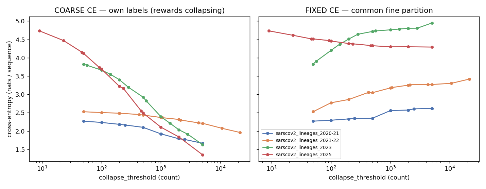
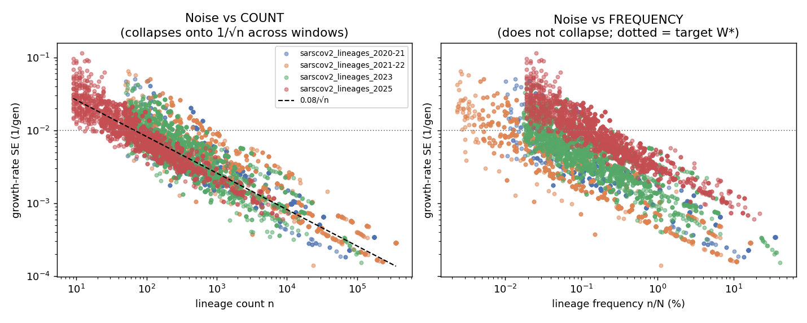
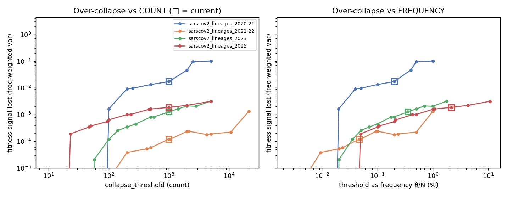

# Inclusion thresholds for SARS-CoV-2 lineages: `collapse_threshold` and `min_core_count`

## Summary

Two per-window levers control which Pango lineages are modeled separately before MLR fitting:
**`collapse_threshold`** (rare lineages below it roll *up into their parent* — a coherent ancestor, not the
universal `other` bucket used for clades) and **`min_core_count`** (a *self-supporting* floor that sends
residual "relic" lineages to `other`). Both are tuned here for the **lineage deltas** analysis: lineages are
used for phylogenetic contrasts (per-branch mutation→fitness), while **clades carry the fitness flux** — so
the right objective is clean branch deltas, even at some cost to the (unused) lineage flux.

This is the lineage counterpart to `clade-analysis.md`, which found that for the collapse-into-`other` case a
**frequency** threshold beats a fixed count. **For lineages the answer inverts** (count, not frequency), and
the parent-rollup structure adds a second failure mode — relic residuals — that the `min_core_count` floor fixes.

**Findings.**

1. The two failure modes live on **different scales**. Estimation **noise** is governed by a lineage's
   **absolute count** — the growth-rate standard error follows `SE ≈ 0.084 / √count` (r = −0.90), essentially
   the textbook 1/√n. Plotted against count, every window collapses onto one curve; against frequency they do
   not (at 0.1–0.3% frequency the SE ranges 5× across windows). So **a fixed count gives consistent precision
   across windows; a fixed frequency does not.**
2. **Over-collapse into a parent is gentle.** Because a child inherits an ancestor's fitness (usually close),
   the frequency-weighted fitness heterogeneity erased by collapsing is small and rises slowly with the
   threshold — far milder than the clade `other` bucket, which merged unrelated fitnesses.
3. So the principled lever for lineages is a **count**, not a frequency — the opposite of clades — because the
   binding constraint is estimation precision, which is count-governed.
4. **Relic residuals** are a third, structural failure mode (see *Relic residuals*). A near-extinct ancestor
   can be resurrected as a retained category by aggregating scattered distant descendants (e.g. a `B.1`
   "residual" with **8** real sequences in 2022). It becomes a poor, distant *parent* in the branch deltas,
   manufacturing long branches (`BA.1 vs B.1`: 35 spike mutations, corrupted −0.56 Δlog-fitness) that crater
   the mutation→fitness Pearson (0.68→0.34) while barely moving Spearman. A **`min_core_count`** off-ramp
   dissolves these at the source.

**Verdict on the current value.** 1000 is safe but **conservative**. The calibrated noise floor is ~30–100
sequences, and at θ = 1000 NUTS-confirmed 95% credible intervals on growth advantage are ≤ 0.015–0.04 — far
tighter than the ~0.1–0.2 spread of growth advantages they need to resolve. A fixed count of 1000 is also a
very different *frequency* across windows: 0.047% of the 2.1M-sequence 2021-22 window but **2.1% of the
47k-sequence 2025 window**, where it collapses 1,155 lineages down to 15.

**Recommendation.** Two levers, both **counts**:
- **`collapse_threshold: 500`** — the count is the right lever (noise is count-governed; a frequency would be
  worse). The noise analysis supports ~200–500: 500 is the conservative end (NUTS 95% CIs ≤ 0.04), 200 the
  efficient end that retains more resolution (see *Choosing the value*).
- **`min_core_count: 200`** — a self-supporting floor: a lineage is retained only if its own exact-label core
  is ≥ 200, otherwise it (and the orphans rolled into it) go to `other`. This dissolves relic residuals and
  recovers the lineage mutation→fitness correlation (see *Relic residuals*).

## Background: the lever

`collapse-lineage-counts.py` uses `pango_aliasor` to iteratively roll any lineage whose window-total count is
below `collapse_threshold` up into its parent (deepest-first, repeating until everything clears the
threshold); rootless basal lineages fall back to `other`. The threshold is a raw count. The two failure modes:

- **Too low** → a retained lineage has too few sequences for a precise growth-rate estimate.
- **Too high** → sub-lineages with genuinely distinct fitness are merged into one parent trajectory.

The representative windows span sequence volume and lineage diversity:

| window | N (sequences) | fine lineages | retained at θ=1000 | θ=1000 as % of N |
|---|--:|--:|--:|--:|
| sarscov2_lineages_2020-21 | 500,491 | ~170 | 38 | 0.200 % |
| sarscov2_lineages_2021-22 | 2,133,000 | ~270 | 89 | 0.047 % |
| sarscov2_lineages_2023 | 282,571 | ~550 | 57 | 0.354 % |
| sarscov2_lineages_2025 | 46,640 | 1,155 | 15 | 2.144 % |

## The same cross-entropy confound as clades

Scoring an MLR fit on its own labels is confounded: a coarser partition has lower entropy, so in-sample
cross-entropy *falls* as you collapse — it rewards collapsing. Scored on a common fine partition (a collapsed
lineage predicted via its retained ancestor's trajectory), fixed-partition CE instead *rises* with the
threshold, as it should.



*Left: coarse CE falls as θ rises (confounded). Right: fixed-partition CE rises — the honest signal that
collapsing destroys resolvable structure. The 2023 window (most lineage diversity) rises most; the sparse
2025 window is nearly flat (little resolvable structure to lose). Fixed CE on its own would pick the lowest
threshold; the noise floor is the counterweight.*

## Noise is count-governed (the count side)

The growth-rate standard error of each retained lineage, computed in closed form from the counts
(`SE_v ≈ 1/√(Σ_t N_t f_{vt}(1−f_{vt})(t−t̄)²)`, the logistic-slope Fisher information), is the deterministic
noise metric.



*Left: pooled across all windows and thresholds, SE vs **count** collapses onto a single `0.084/√count` band —
precision is set by absolute count. Right: vs **frequency** the windows separate (the sparse 2025 window, red,
sits well above the others) — the same frequency is a different number of sequences, hence different
precision.* Binned medians make the contrast concrete:

| | count 100–300 | count 300–1k | count 1k–3k | count >3k |
|---|--:|--:|--:|--:|
| 2020-21 | 0.0053 | 0.0032 | 0.0024 | 0.0007 |
| 2021-22 | 0.0111 | 0.0053 | 0.0027 | 0.0007 |
| 2023 | 0.0068 | 0.0036 | 0.0019 | 0.0009 |
| 2025 | 0.0055 | 0.0033 | 0.0016 | 0.0011 |

At a given count the SE is consistent across windows spanning 47k–2.1M sequences; binned by frequency it is
not (a 0.1–0.3% lineage has SE 0.0016 in 2021-22 but 0.0082 in 2025).

## Over-collapse is gentle (the frequency side)

When a sub-lineage is rolled into its parent it is assigned the parent's fitness; the cost is the
frequency-weighted variance of fine-lineage growth advantages erased within each collapsed group.



*The fitness heterogeneity destroyed rises with the threshold but plateaus at a small level (~10⁻⁴–10⁻¹ in
growth-advantage² units; RMS ~0.01–0.1), and is largest for 2020-21 (the Delta era, when sub-lineages had
genuinely diverse fitness). This is far gentler than the clade `other` case, because parent and child
fitnesses are close.* The contrast with the steep fixed-CE rise is the point: most of what collapsing
destroys is *label* resolution, not *fitness* resolution — which is what matters for the flux.

## NUTS re-validation

The analytic SE is a Fisher-information estimate; NUTS (200/200, = production sampler) gives the gold-standard
posterior. Two checks. Against the existing **production** (hierarchical) NUTS fits at θ = 1000, the real
growth-rate SD is ~1.3× the proxy (1.15–1.72× per window) — the pooling layer widens intervals slightly.
Against **matched non-hierarchical** NUTS re-fits at the candidate θ = 500 (the setting the sweep actually
uses), the proxy is essentially exact:

| window | retained lineages | ga 95% CI width (median / max) | real/proxy SD ratio |
|---|--:|--:|--:|
| sarscov2_lineages_2020-21 | 69 | 0.004 / 0.023 | 0.48 |
| sarscov2_lineages_2021-22 | 133 | 0.011 / 0.112 | 1.52 |
| sarscov2_lineages_2023 | 119 | 0.006 / 0.041 | 0.75 |
| sarscov2_lineages_2025 | 28 | 0.008 / 0.015 | 1.02 |

So the proxy is within ~0.5–1.7× of NUTS across settings — well-calibrated. At θ = 500 the median lineage's
95% CI is ≤ 0.011 in every window (≤ 0.04 for the worst-resolved lineage in three of four; up to ~0.11 for a
few transient lineages in the strong-selection 2021-22 window), versus a between-lineage growth-advantage
spread of SD ~0.08–0.23. θ = 500 is comfortably above the noise floor.

## Count vs frequency, and why it differs from clades

| | clades (`clade_min_*`) | lineages (`collapse_threshold`) |
|---|---|---|
| collapse target | universal `other` (incoherent mixture) | parent lineage (coherent ancestor) |
| over-collapse damage | large, frequency-scaled | gentle (child ≈ parent fitness) |
| binding failure mode | over-collapse (a real clade lost into `other`) | estimation noise |
| noise vs over-collapse scale | frequency | **count** (noise) |
| principled lever | **frequency** (`clade_min_freq`) | **count** (`collapse_threshold`) |

The levers differ because the *binding* failure mode differs. For clades, the danger is folding a
consequential-frequency clade into an incoherent bucket, so frequency is the right scale. For lineages,
parent-rollup makes over-collapse benign, so the binding constraint is precision — which is count-governed —
and a count is correct. A frequency threshold for lineages would be actively worse: it would retain noisy
low-count lineages in small windows and over-collapse large ones.

## Is 1000 right?

It is safe but conservative, and as a fixed count it over-collapses small windows. At 2.1M sequences (2021-22)
θ = 1000 is 0.047% of N and retains 89 lineages; at 47k sequences (2025) the same 1000 is 2.1% of N and
retains only 15, folding 1,155 lineages into them — discarding resolvable structure that NUTS shows is
precisely estimable (95% CIs ≤ 0.015 even at θ = 500). The calibrated noise floor (~30–100 sequences) sits far
below 1000.

## Choosing the value

There is no hard noise cutoff — lowering the threshold trades resolution for noise smoothly. A principled
criterion ties the threshold to the collapse decision's purpose: **retain a lineage separately only while its
fitness is statistically distinguishable from its parent's.** Below that point the separate estimate is
indistinguishable from being part of the parent (spurious resolution, pure noise); above it, a real difference
is being resolved. The key reason there is no cliff: the *value* of resolving a lineage and the *difficulty*
of resolving it both scale with the same quantity — its growth-advantage difference from its parent, Δ. So the
returns to lowering the threshold diminish smoothly: lineages worth resolving (large Δ) are easy to resolve at
low count, while lineages that are hard to resolve (small Δ) cost almost nothing to collapse into a
near-identical parent.

Measured from the fits, the typical parent–child difference is **median |Δ| ≈ 0.035** (distribution
~0.015–0.11, with a tail of large variant-transition jumps). The marginal retained lineage has count ≈ θ and
growth-rate SE ≈ 1.3·0.084/√θ (NUTS-calibrated), giving this signal-to-noise at the margin:

| θ | SE at margin | D/SE (signal/noise) | resolves Δ down to (2σ) |
|--:|--:|--:|--:|
| 100 | 0.011 | 3.2 | 0.022 |
| 200 | 0.0077 | 4.5 | 0.015 |
| 300 | 0.0063 | 5.6 | 0.013 |
| 500 | 0.0049 | 7.2 | 0.010 |

The bare distinguishability floor — where the marginal lineage can just resolve the typical Δ at 2σ — is
**θ ≈ 40**; all four candidates clear it. The remaining consideration is **overdispersion**: the SE above is
the Fisher/NUTS bound under iid-multinomial sampling, but real sequence sampling clusters (outbreaks, travel),
inflating SE beyond it (NUTS already shows up to 1.5× in the high-selection 2021-22 window; true
overdispersion can be ~2×). Under a 2× inflation, θ = 100 drops to ~2.1σ (marginal) while θ = 200 holds at
~2.9σ. So **θ ≈ 200 is the efficient principled choice**: ~5× above the bare floor, resolving the typical
parent–child difference at >3σ even under overdispersion, while retaining roughly 2× more lineages than 500
(e.g. 247 vs 119 retained in 2023). θ = 100 is the aggressive floor (fine in large windows, marginal in
small/high-selection ones); θ = 500 errs conservative, leaving some resolvable structure on the table.

## Relic residuals and the `min_core_count` off-ramp

A count threshold has a third, structural failure mode that the noise / over-collapse axes miss. When rare
lineages roll up, a near-extinct **ancestral** lineage can be resurrected as a retained category by
aggregating scattered, phylogenetically-distant descendants that have no closer retained ancestor — e.g. a
`B.1` "residual" with only **8 actual B.1 sequences** in the 2022 window, padded past the threshold by a
grab-bag of unrelated B.1-descendants. It is an `other`-like mixture wearing a real lineage's name: it gets a
single (misspecified) MLR fitness, and — more damagingly — it becomes the *closest retained parent* for
highly-derived descendants, manufacturing long branches like `BA.1 vs B.1` (**35 spike mutations**, but a
meaningless **−0.56** Δlog-fitness, because the relic is a poor fitness reference).

These long relic branches are high-leverage outliers in the lineage-deltas (mutation→fitness) analysis: they
crater the **Pearson** correlation (0.68 → 0.34 going from `collapse_threshold` 1000 → 500) while barely moving
**Spearman** — the classic leverage signature. The culprits are exactly the branches whose parent has a tiny
exact-label "core" (`B.1`=8, `B.1.1`=25, `BA.2`-in-2023=20).

**The fix** is a collapse-time *self-supporting* off-ramp (`--min-core-count` in `collapse-lineage-counts.py`):
a lineage is retained as its own category only if its **exact-label core ≥ a floor**; otherwise it — and the
orphans rolled into it — go to `other`, and descendants reroute to their nearest *real* ancestor (or become
rootless, dropping the corrupted branch). The discriminator is **absolute core size**, not purity or topology:
a legitimate lineage that absorbs many rare descendants (large bucket, substantial own core) is kept; a relic
has a tiny core regardless of bucket.

Tuning the floor against the end-to-end mutation→fitness correlation (all 12 seasons, fast MAP fits, at
`collapse_threshold` 500) gives a clean interior optimum at **200**:

| `min_core_count` | branches | spike Pearson | s1 | rbd |
|--:|--:|--:|--:|--:|
| off | 1006 | 0.244 | 0.254 | 0.235 |
| 100 | 939 | 0.579 | 0.594 | 0.574 |
| **200** | **912** | **0.653** | **0.677** | **0.668** |
| 300 | 878 | 0.604 | 0.628 | 0.633 |
| 500 | 804 | 0.601 | 0.619 | 0.619 |

Below 200, relics survive; above 200, genuine branches start dropping (n falls). These are MAP numbers — the
MAP baseline is 0.244 vs the production-NUTS 0.34, so under NUTS the floor-200 correlation should land ~0.75.

**Trade-off.** The off-ramp cannot tell an ancient relic from a *recently-diversified* clade whose own core is
small only because its sublineages dominate (e.g. `LP.8.1`, `XFG.5/6` in 2025-26), so in recent/small windows
it also folds ~5–9% of those live clades into `other`. That is an accepted cost: lineages drive the per-branch
deltas and clades carry the flux, so trading a slightly worse (unused) lineage flux for clean deltas is the
right call.

## Recommendation

Production config for the 12 `sarscov2_lineages_*` datasets — two levers, both counts:

1. **`collapse_threshold: 500`, kept as a count.** Noise — the binding constraint for lineages — is
   count-governed: a fixed count gives consistent precision across windows, a fixed frequency does not. 500 is
   the conservative end of the supported ~200–500 range (NUTS-confirmed 95% CIs ≤ 0.04); 200 is the efficient
   end that retains ~2× more lineages (see *Choosing the value*). Do not switch to a frequency — that was the
   right call for clades, not here.
2. **`min_core_count: 200`** — the self-supporting off-ramp that dissolves relic residuals, tuned to the
   end-to-end mutation→fitness correlation (see *Relic residuals*). Implemented as `--min-core-count` in
   `collapse-lineage-counts.py` (default off), wired through `rules/sequence_counts.smk`, and set in
   `defaults/config.yaml`.
3. **Optimize for the deltas, not the flux.** Lineages are used for phylogenetic contrasts (per-branch
   mutation→fitness); **clades carry the fitness flux**. Both levers are set to maximize clean branch deltas,
   accepting that `min_core_count` slightly degrades the (unused) lineage flux in recent windows. The
   load-bearing conclusions: *count not frequency*, plus a *self-supporting core floor*.

## Caveats and scope

- Point estimates (growth advantages, frequencies) for the over-collapse and CE metrics come from fast **MAP**
  fits; the **noise** metric is the analytic Fisher-information SE (deterministic, theory-grounded), calibrated
  against and re-validated under **NUTS** (the production sampler). FullRank/mean-field ADVI were rejected:
  FullRank's O(params²) covariance does not scale to the 170+ lineages at low thresholds, and mean-field is
  convergence-sensitive.
- The SE proxy is the Cramér–Rao (best-case) bound under a correctly specified logistic model; real sampling
  is overdispersed, so the true floor is somewhat higher — hence the recommended margin. NUTS calibration
  (ratio ~1.0–1.7×) bounds the gap.
- Single-location (USA), non-hierarchical fits; the collapse_threshold analysis uses four representative
  windows, the `min_core_count` tuning uses all 12 seasons. Production is hierarchical NUTS.
- The `min_core_count` floor was tuned end-to-end on fast **MAP** fits; the final production Pearson/Spearman
  come from re-running under NUTS (expected ~0.75 at floor 200, vs the MAP 0.65).
- The off-ramp cannot distinguish an ancient relic from a recently-diversified clade with a small own core, so
  it over-dissolves some live clades in recent/small windows (~5–9% of mass into `other`) — accepted because
  the lineage flux is unused (clades carry the flux).
- `collapse_threshold: 500` and `min_core_count: 200` are set in `defaults/config.yaml`; the full production
  NUTS rebuild (collapse → relationships → MLR → branch deltas → predictor correlations) is the follow-up that
  produces the final estimates.

## Reproduce

```
# collapse_threshold analysis (4 representative windows)
python inclusion-thresholds/scripts/sweep_clade_min_seq.py --dataset sarscov2_lineages_<window>  # MAP sweep
python inclusion-thresholds/scripts/score_lineage_sweep.py   # -> results/lineage_*.tsv
python inclusion-thresholds/scripts/plot_lineage_sweep.py    # -> figures/lineage_*.png
# NUTS re-validation at theta=500 reuses each window's collapsed_seq_counts.tsv with
# scripts/mlr-config-lineage-nuts.yaml.

# min_core_count off-ramp tuning (collapse + relationships + MAP MLR + deltas correlation, 12 seasons)
python inclusion-thresholds/scripts/verify_offramp.py
```
